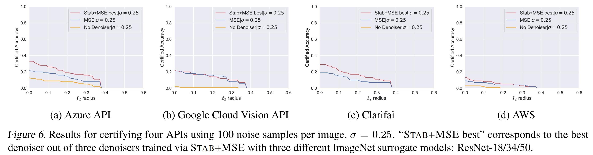

## Certify online Vision API
This directory contains code for replicating our experiments of creating robust versions of four online Vision APIs: 
* [Azure Vision API](https://docs.microsoft.com/en-us/azure/cognitive-services/computer-vision/) 
* [Google Computer Vision API](https://cloud.google.com/vision/)
* [Clarifai API](https://www.clarifai.com/)
* [AWS Recoknition API](https://aws.amazon.com/rekognition/)

### Overview
* `robust_api.py` contains the `RobustAPI` class for wrapping any of the above Vision APIs leading to provably robust ones.  
    ```python 
    # To robustify an ONLINE API (api_name can be "azure", "google", "aws", "clarifai")
    majority_class, _, _ = RobustAPI(api_name, denoiser=denoiser, online=True).predict(img, ...)
    majority_class, radius, logs = RobustAPI(api_name, denoiser=denoiser, online=True).certify(img, ...)

    # To use the OFFLINE version (i.e. read from previous query logs, no denoiser needed)
    majority_class, _ = RobustAPI(api_name, online=False).predict(logs, ...)
    majority_class, radius = RobustAPI(api_name, online=False).certify(logs, ...)
    ```
* `certify_api.py` contains the code for online certification of the APIs.  
* `certify_from_file.py` contains the code for offline certification of the APIs via query log files.  
* `tutorial.ipynb` contains the jupyter notebook for demonstration.
* `run_certify.sh` contains all the commands we used in our paper for certifying Vision APIs.
* `images/` contains the 100 randomly sampled test images, from ImageNet validation set, that we use in our paper as a benchmark for certification of public vision APIs.


### Setting up access to four APIs

1. Azure Vision API:
Follow [this link](https://docs.microsoft.com/en-us/azure/cognitive-services/cognitive-services-apis-create-account?tabs=singleservice%2Cunix) and obtain the keys for your Azure Cognitive Services. Then create environment variables for the API key `AZURE_COMPUTER_VISION_SUBSCRIPTION_KEY` and the endpoint URL `AZURE_COMPUTER_VISION_ENDPOINT`.
2. Google Computer Vision API:
Follow the instructions on [this link](https://cloud.google.com/vision/docs/before-you-begin). In the end, you should set the environment variable `GOOGLE_APPLICATION_CREDENTIALS` to the path of the JSON file where your service account key is stored.
3. Clarifai API:
Authentication to the API is handled through API Keys. Obtain the Clarifai API access key and set the environment variable `CLARIFAI_API_KEY` accordingly.
4. AWS Recoknition API:
Follow the two instructions in Step 1 in [this link](https://docs.aws.amazon.com/rekognition/latest/dg/labels-detect-labels-image.html#w696aac25c19b7b6b3b5). In the end, you should set two variables `aws_access_key_id` and `aws_secret_access_key` in the `~/.aws/config` file.

### Getting started
1. Install the API-related dependencies
```
pip install google-cloud-vision boto3 clarifai
# boto3 is for aws API
```
2. Online certification of APIs
```
python certify_api.py --noise_sd 0.12 --N0 20 --N 100 --api azure --denoiser_checkpoint $PATH_TO_DENOISER --save $OUTPUT_DIR 
```
- `--noise_sd`: the noise level
- `--N0`: the number of examples to estimate the top class
- `--N`: the number of examples to estimate the lower probability bound of top class
- `--api`: which api to use ("azure", "google", "clarifai", "aws")
- `--denoiser_checkpoint`: path to the trained denoisers
- `--save`: the output directory to save the results in

3. Offline certification of APIs
```
python certify_from_file.py --noise_sd 0.12 --N0 20 --N 100 --api azure 
        --log_dir ../data/certify/vision_api/azure/imagenet_denoiser_mse/0.12/ 
        --save ./certification_output
```
- `--noise_sd`: the noise level
- `--N0`: the number of examples to estimate the top class
- `--N`: the number of examples to estimate the lower probability bound of top class
- `--api`: which api to use ("azure", "google", "clarifai", "aws")
- `--log_dir`: path to the folder containing the API query logs
- `--save`: the output directory to save the results in

For all the commands used in our paper, check [here](run_certify.sh)! By running these commands and then running `python code/analyze.py`, you should be able to generate the below figure.

<p>

</p>

